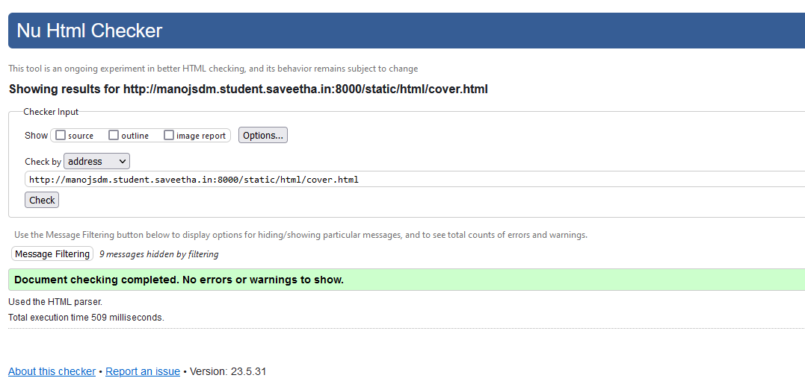

# cover-page-design
## AIM:
To develop a website to display the cover page design of a book

## Design Steps:

### Step 1:

Clone the github repository.
### Step 2:
Create Django project make the necessary changes in settings.py
### Step 3:
Create new folder for your HTML,CSS and images.

### Step 4:
Write your HTML and CSS Code for your Book Cover.

### Step 5:
Run the server and ensure your Book cover page is Looking properly .
### Step 6:
Take a Screenshoot of your page and paste your code and screenshoot on README.md
### Step 7:
Then push your repository.
## Code:
```
Name : Manoj S
Reg no : 212222100025
```
```
<!DOCTYPE html>
<html lang="en">
    <head>
        <meta charset="utf-8">
        <meta http-equiv="X-UA-Compatible" content="IE=edge">
        <meta name="viewport" content="width=device-width ,initial-scale=1.0" >
        <style>

            .coverimage{
                color: white;
                font-style: bold;
                margin-left: auto;
                margin-right: auto;
                padding: 40px;
                background-repeat:no-repeat;
                width: 400px;
                height: 600px;
                background-image: url(/static/images/pxfuelst.jpg);
                background-size:100% 100%;
            }
            .topleft{
                top: 20px;
                text-align: center;
                font-size: 15px;
                font-weight: 500;
                font-style: Georgia;
                color: rgb(227, 247, 156);
            }
            .bookname{
                text-align:center;
                font-family: Algerian;
                position: relative;
                font-size: 28px;
            }
            .subtitle{
                font-size: large;
                position: relative;
                bottom : 10px;
                line-height: 2pc;
                font-family: Rockwell;
                color: rgb(65, 74, 114);
                text-align: center;
            }
            .image{
                position: relative;
                top: px;
                left: 300px;
                width: 190px;
                height: 260px;
                bottom: 100px;
            }
            img{
        
                border-radius: 5%;
            }
            .edision{
                color: rgba(32, 124, 71, 0.487);
                position: relative;
                font-size: 25px;
                font-weight: 500;
                top : 20px;
            }  
            .author{

                font-family: chiller;
                font-size: 25px;
                font-weight: 500;
                position: relative; 
                bottom: 240px;
                text-align: right;

            }
            .publisher{
                position:relative;
                bottom: 345px;
                font-size: 30px;
                font-weight: 500;
                color: rgba(165, 8, 8, 0.706);
            
            }
        </style>
    </head>
    <body>
        <div class="coverimage">
            <div class="topleft">EXPERT INSIGHT </div>
            <div class="bookname" ><h1><b>Responsive Web  Design  With  HTML5 <br> AND CSS</b></h1> </div>
            <div class="subtitle">
                <h3>Develop  future-proof  responsive  websites  using  the latest  HTML5  and  CSS  Techniques</h3>
            </div>
            <div class="edision"><p><b>Third Edision</b></p></div>
            <div class="image"> </div>
            <div class="author"><p><b>MANOJ S</b></p></div>
            <div class="publisher"><p><b>&lt; Packt&gt;</b<></p></div>
        </div>
    </body>
</html>
```

## Output:

### validation:


## Result:
The page for designing book cover page using HTML and CSS is executed successfully.
